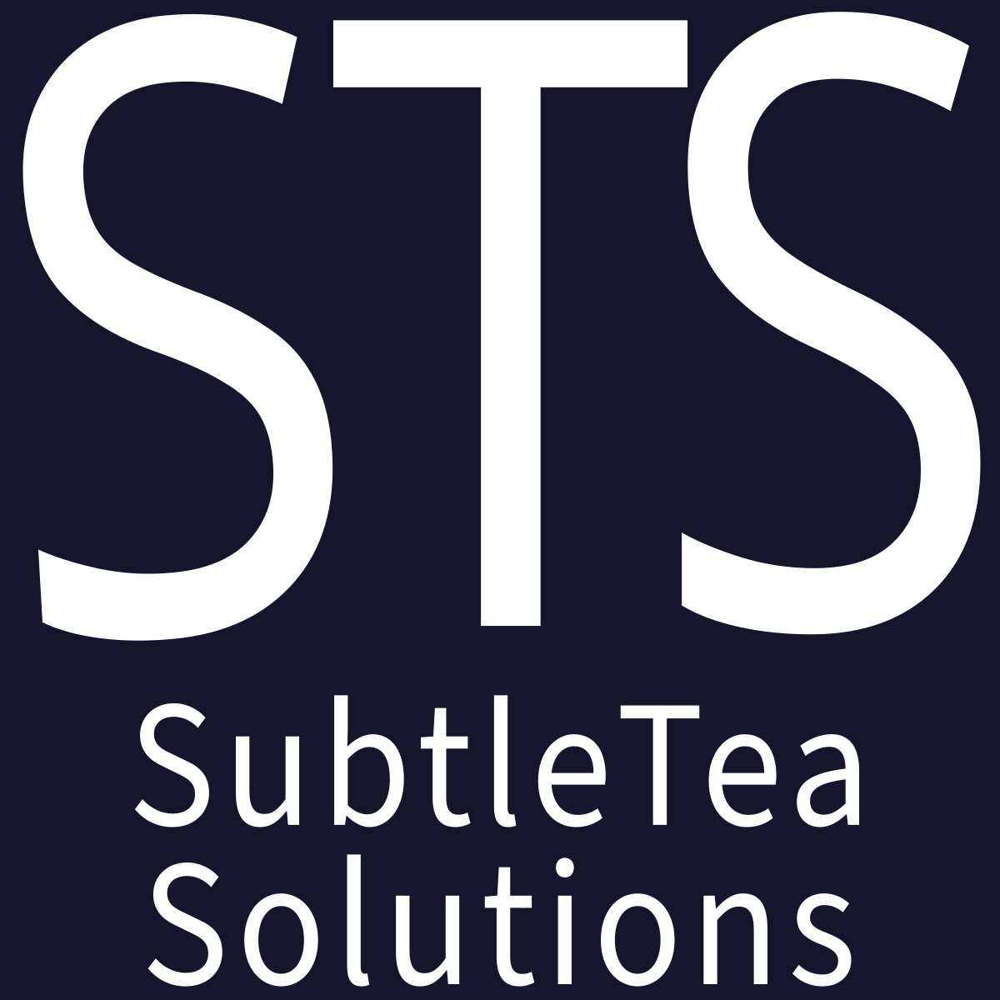

# SubtleTea Solutions

## Social Science for a World Where Sustainability is the More Lucrative Choice {style="font-size: 18px; margin-bottom: 3.5rem;"}

{.float-right width=180px}

At SubtleTea Solutions we have three core divisions:

- **Research:** Those with ears to hear, let them hear!
- **Intelligence:** When you know, you know.
- **Education:** Because you don't hide a candle under a bushel; you
  put it at the top of the house so it provides light to all residing there.

### Publishing {style="margin-top: 4rem;"}

To expand the reach of our educational materials, we have both video and
literature publishing operations. 

This provides direct revenue from sales and
subscriptions. 

Publishing is also a way to shape how people see the world, which
can help improve the apparent desirability and comprehension of SubtleTea's 
products, intelligence, and research. This drives long-term growth by lifting up
new generations of customers through careful education.

We publish video content through our production studio, the [SubtleTea
Network](#network).

Our imprint is [Agile Publishers](https://agilepublishers.com).

### Sister Non-Profit: Generation of Participation in Democracy (GPD) {style="margin-top: 2rem;"}

Our sister non-profit organization, [GPD Américas](https://gpdamericas.org),
seeks out important applications of SubtleTea Solutions' technology and
insights to areas of significant need among marginalized folks. 

The first flagship organization is the [Instituto
Dourados](https://institutodourados.org), on a mission to develop digital twin
models of real communities to optimize the use of limited public health
resources in Indigenous communities.

### Contact Us {style="margin-top: 2rem;"}

To learn more about how SubtleTea Solutions can help you and your organization
plan policy interventions and other social strategies, please [reach
out](mailto:contact@subtleteasolutions.com).

